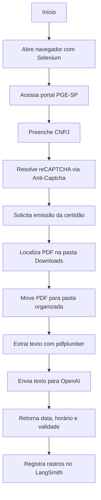

# 🤖 Automação Inteligente para CND da Dívida Ativa

<p align="center">
  <strong>RPA fiscal com Selenium, extração inteligente com OpenAI e rastreabilidade com LangSmith/LangGraph.</strong>
</p>

<p align="center">
  
  
  
  
</p>

---

## 📌 Visão geral

Este projeto automatiza o processo de emissão, download, organização e leitura de **Certidões da Dívida Ativa (CND/CRDA)** no portal da **PGE-SP**.

A solução combina:

- **RPA com Selenium** para navegar no portal, preencher CNPJ, resolver reCAPTCHA via Anti-Captcha e baixar a certidão em PDF.
- **IA generativa com OpenAI** para interpretar o conteúdo do PDF e extrair dados fiscais importantes.
- **LangSmith** para rastrear cada etapa da execução, prompts, respostas e eventuais erros.
- **LangGraph** para orquestrar o fluxo em etapas claras e auditáveis.

> Ideal para rotinas fiscais, backoffices, BPOs, escritórios contábeis e times que precisam reduzir trabalho manual em consultas recorrentes de certidões.

---

## ✨ Principais recursos

- ✅ Automação de acesso ao portal da Dívida Ativa da PGE-SP.
- ✅ Preenchimento automático do CNPJ base configurado em ambiente.
- ✅ Resolução de reCAPTCHA com Anti-Captcha.
- ✅ Download e movimentação automática do PDF gerado.
- ✅ Organização do arquivo por ano e mês em uma pasta de destino.
- ✅ Leitura do PDF com `pdfplumber`.
- ✅ Extração com IA dos seguintes campos:
  - data de emissão;
  - horário de emissão;
  - validade da certidão.
- ✅ Observabilidade das etapas com `@traceable` do LangSmith.
- ✅ Fluxo opcional orquestrado por LangGraph.

---

## 🧱 Arquitetura



### Camadas da solução

| Camada | Responsabilidade | Tecnologias |
| --- | --- | --- |
| **Automação RPA** | Navegação, clique, preenchimento, CAPTCHA, download e organização do PDF | Selenium, WebDriver Manager, Anti-Captcha API |
| **Processamento de PDF** | Leitura e extração do texto da certidão | pdfplumber |
| **IA Cognitiva** | Interpretação do texto fiscal e extração de informações | OpenAI, LangChain |
| **Observabilidade** | Rastreamento das funções, prompts, respostas e falhas | LangSmith |
| **Orquestração** | Encadeamento do processo em etapas de grafo | LangGraph |

---

## 📂 Estrutura do projeto

```text
.
├── CND_IA.py          # Robô principal: Selenium + Anti-Captcha + download + extração com IA
├── config_IA.py       # Configuração da IA e classe responsável por consultar o modelo OpenAI
├── LangGraph.py       # Orquestração do fluxo usando LangGraph
├── requirements.txt   # Dependências Python do projeto
└── README.md          # Documentação do projeto
```

---

## 🧩 Descrição dos arquivos

### `CND_IA.py`

Contém a rotina principal de automação:

- carrega variáveis do `.env`;
- inicia o Chrome com Selenium;
- acessa o portal da PGE-SP;
- fecha pop-up inicial quando existir;
- navega até a emissão de CRDA;
- informa o CNPJ base;
- captura a `sitekey` do reCAPTCHA;
- cria e consulta uma tarefa na Anti-Captcha API;
- injeta o token no navegador;
- solicita a emissão da certidão;
- procura o PDF gerado na pasta `Downloads`;
- move o arquivo para a pasta final organizada por ano e mês;
- chama a IA para extrair as informações do PDF.

### `config_IA.py`

Define a classe `IADividaAtiva`, responsável por:

- configurar o modelo `gpt-4o-mini`;
- criar mensagens de sistema e usuário;
- enviar o texto extraído do PDF para a IA;
- retornar respostas estruturadas para as perguntas fiscais configuradas.

### `LangGraph.py`

Monta um grafo simples com as etapas:

1. `download`: executa a automação principal;
2. `extracao`: marca a conclusão da extração;
3. `END`: finaliza o fluxo.

Esse arquivo permite executar o processo com uma estrutura mais preparada para expansão futura, como novas validações, retentativas, notificações ou persistência de resultados.

---

## ⚙️ Pré-requisitos

Antes de executar, garanta que você possui:

- **Python 3.10+** instalado;
- **Google Chrome** instalado;
- acesso à internet;
- uma chave válida da **OpenAI**;
- uma chave válida da **LangSmith**;
- uma chave válida da **Anti-Captcha**;
- permissão de escrita na pasta de destino configurada em `BASE_PATH`.

---

## 🚀 Instalação

### 1. Clone o repositório

```bash
git clone <url-do-repositorio>
cd Projeto_com_OpenIA
```

### 2. Crie e ative um ambiente virtual

#### Windows

```bash
python -m venv .venv
.venv\Scripts\activate
```

#### Linux/macOS

```bash
python3 -m venv .venv
source .venv/bin/activate
```

### 3. Instale as dependências

```bash
pip install -r requirements.txt
```

> Observação: o código usa integrações do ecossistema LangChain/OpenAI. Se o seu ambiente acusar ausência de pacotes como `langchain-openai` ou `langchain`, instale-os conforme a versão compatível com seu ambiente.

---

## 🔐 Configuração de ambiente

Crie um arquivo `.env` na raiz do projeto:

```env
# OpenAI
CHAVE_OPENIA=sk-xxxxxxxxxxxxxxxxxxxxxxxxxxxxxxxx

# LangSmith / LangChain tracing
LANGSMITH_API_KEY=lsv2_xxxxxxxxxxxxxxxxxxxxxxxx
LANGCHAIN_TRACING_V2=true
LANGCHAIN_PROJECT=CND_Divida_Ativa

# Anti-Captcha
CHAVE_API=xxxxxxxxxxxxxxxxxxxxxxxxxxxxxxxx

# Empresa consultada
CNPJ_BASE=xxxxxxxxxxxxxx

# Pasta base onde os PDFs serão organizados
BASE_PATH=C:\Caminho\Para\Pasta\Base
```

### Variáveis utilizadas

| Variável | Obrigatória | Descrição |
| --- | --- | --- |
| `CHAVE_OPENIA` | Sim | Chave de API usada para acessar o modelo da OpenAI. |
| `LANGSMITH_API_KEY` | Sim | Chave de API usada para enviar traces ao LangSmith. |
| `LANGCHAIN_TRACING_V2` | Recomendado | Habilita rastreamento do LangChain/LangSmith. |
| `LANGCHAIN_PROJECT` | Recomendado | Nome do projeto no LangSmith. |
| `CHAVE_API` | Sim | Chave da Anti-Captcha API. |
| `CNPJ_BASE` | Sim | CNPJ base usado na consulta da certidão. |
| `BASE_PATH` | Sim | Diretório raiz onde o PDF final será salvo. |

---

## ▶️ Como executar

### Execução direta do RPA

```bash
python CND_IA.py
```

Esse comando executa o fluxo completo:

1. abre o navegador;
2. acessa o portal da PGE-SP;
3. resolve o CAPTCHA;
4. emite e baixa a certidão;
5. move o PDF para a estrutura de pastas;
6. extrai os dados do PDF com IA;
7. registra a execução no LangSmith.

### Execução via LangGraph

```bash
python LangGraph.py
```

Use esta opção quando quiser executar o processo por meio do grafo de estados, facilitando a evolução do fluxo para cenários mais robustos.

---

## 🗃️ Organização dos PDFs

Após o download, o projeto move a certidão para uma estrutura semelhante a:

```text
<BASE_PATH>/
└── CND - Divida Ativa/
    └── 2026/
        └── 05 - Maio/
            └── crda_..._validade_14-05-2026.pdf
```

O nome do arquivo recebe a data de execução no formato `dd-mm-aaaa`.

---

## 🔎 Monitoramento com LangSmith

As principais funções são decoradas com `@traceable`, permitindo acompanhar no LangSmith:

- tempo de execução;
- entrada e saída das funções;
- chamadas à IA;
- respostas do modelo;
- falhas no CAPTCHA, Selenium ou movimentação de arquivos;
- histórico de execuções por projeto.

---

## 🧪 Validação local

Para uma checagem rápida de sintaxe, execute:

```bash
python -m py_compile CND_IA.py config_IA.py LangGraph.py
```

Para uma validação funcional completa, será necessário ter as chaves e variáveis do `.env` configuradas, além de acesso ao portal externo e ao serviço Anti-Captcha.

---

## 🛠️ Solução de problemas

| Problema | Possível causa | Como resolver |
| --- | --- | --- |
| `TypeError` ao montar caminho de destino | `BASE_PATH` não configurado | Defina `BASE_PATH` no `.env`. |
| Falha ao iniciar ChromeDriver | Chrome ausente ou incompatível | Atualize o Google Chrome e reinstale dependências. |
| CAPTCHA não resolvido | Saldo insuficiente ou erro na Anti-Captcha API | Verifique `CHAVE_API`, saldo e status da API. |
| PDF não encontrado | Download não concluído ou nome diferente do esperado | Verifique a pasta `Downloads` e o tempo de espera. |
| Erro de autenticação OpenAI | Chave inválida ou ausente | Confirme `CHAVE_OPENIA`. |
| Traces não aparecem no LangSmith | Chave/projeto incorretos | Confirme `LANGSMITH_API_KEY` e `LANGCHAIN_PROJECT`. |

---

## 🔒 Boas práticas de segurança

- Nunca versionar o arquivo `.env`.
- Nunca expor chaves de API em prints, logs públicos ou commits.
- Usar CNPJ e credenciais apenas em ambientes autorizados.
- Respeitar as políticas de uso dos portais públicos e dos serviços de CAPTCHA.
- Revisar periodicamente permissões de pastas e credenciais de API.

---

## 🧭 Roadmap sugerido

- [ ] Salvar o resultado extraído em JSON, CSV ou banco de dados.
- [ ] Criar logs estruturados com `logging`.
- [ ] Separar configurações em um módulo próprio.
- [ ] Adicionar testes unitários para extração e montagem de caminhos.
- [ ] Implementar retentativas mais granulares por etapa do fluxo.
- [ ] Enviar notificação por e-mail, Teams ou Slack ao final da execução.
- [ ] Parametrizar múltiplos CNPJs em lote.
- [ ] Adicionar execução headless opcional.

---

## 🤝 Contribuição

Contribuições são bem-vindas. Para evoluir o projeto:

1. crie uma branch com uma descrição clara;
2. implemente a melhoria;
3. valide a sintaxe e, quando possível, execute o fluxo em ambiente controlado;
4. abra um pull request descrevendo o que mudou e como foi testado.

---

## 📄 Licença

Este repositório ainda não possui um arquivo de licença definido. Antes de usar em produção ou distribuir, defina a licença apropriada para o projeto.

---

<p align="center">
  Desenvolvido para automatizar rotinas fiscais com mais velocidade, rastreabilidade e inteligência. 🚀
</p>
